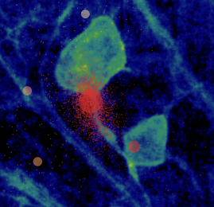

# Herding Spikes 2

## Software for high density electrophysiology

This software provides functionality for the detection, localisation and clustering of spike data from dense multielectrode arrays based on the methods described in the following papers:

J.-O. Muthmann, H. Amin, E. Sernagor, A. Maccione, D. Panas, L. Berdondini, U.S. Bhalla, M.H. Hennig MH (2015). [Spike detection for large neural populations using high density multielectrode arrays](http://journal.frontiersin.org/article/10.3389/fninf.2015.00028/abstract). Front. Neuroinform. 9:28. doi: 10.3389/fninf.2015.00028.

G. Hilgen, M. Sorbaro, S. Pirmoradian, J.-O. Muthmann, I. Kepiro, S. Ullo, C. Juarez Ramirez, A. Puente Encinas, A. Maccione, L. Berdondini, V. Murino, D. Sona, F. Cella Zanacchi, E. Sernagor, M.H. Hennig (2016). [Unsupervised spike sorting for large scale, high density multielectrode arrays.](http://www.cell.com/cell-reports/fulltext/S2211-1247(17)30236-X) Cell Reports 18, 2521–2532. bioRxiv: <http://dx.doi.org/10.1101/048645>.

This implementation is highly efficient, spike detection and localisation runs in real time on recordings from 4,096 channels at 7kHz on a desktop PC. Large recordings with millions of events can be sorted in minutes.

Since we believe publicly funded research code should be free and open, all code is released under GPL-3.0.

### Supported systems  

- [3Brain](http://3brain.com/) BIOCAM and BIOCAM X
- [Neuropixel array](https://www.ucl.ac.uk/neuropixels)
- [ETH MEA1K](https://www.bsse.ethz.ch/bel/research/cmos-microsystems/microelectrode-systems.html)
- [128 channel Neuroseeker array](http://neuroseeker.eu/)

## Contributors, alphabetical 

- [Matthias Hennig](http://homepages.inf.ed.ac.uk/mhennig/index.html): Spike sorting
- [Jano Horvath](https://github.com/JanoHorvath): Parameter optimisation
- [Cole Hurwitz](https://github.com/colehurwitz31): Spike detection, localisation and sorting
- [Oliver Muthmann](mailto:ollimuh@googlemail.com): Spike detection and localisation
- [Albert Puente Encinas](https://github.com/albertpuente): C++ implementation, optimisation and parallelisation
- [Martino Sorbaro](http://martinosorb.github.io): Spike sorting
- [Cesar Juarez Ramirez](mailto:cesaripn2@gmail.com): Visualisation
- [Raimon Wintzer](https://github.com/lsIand): GUI and visualisation

## Quick start 

The code has been tested with Python version 3.6. It is essential the following packages are available:
`Cython numpy scipy h5py pandas sklearn matplotlib`.

We suggest you install the code in a virtual environment. You can create one by running

    python3 -m venv desired/location/HS2venv
    source desired/location/HS2venv/bin/activate

You will need to `activate` whenever you're using the module.

The module can automatically be installed, including all dependencies, by running

    python3 setup.py install

This will also compile the cython code.

Example code for the different supported systems is in the folder [notebooks](notebooks). Go [here](documentation) for documentation. A worked example for Biocam data is [here](documentation/biocam/BioCam-demo.md).

## Contact

The herders are based at the School of Informatics, University of Edinburgh. Contact us [here](http://homepages.inf.ed.ac.uk/mhennig/contact/), we are happy to help.
